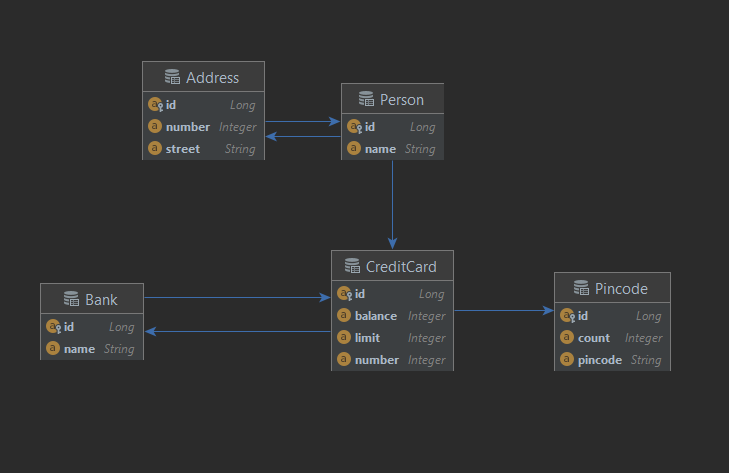

# DAT250: Software Technology Experiment Assignment 2
### Isabel Foster 

## Experiment 1 
### Part 1
For the first experiment I cloned the example project and followed the tutorial from step 4.3. 
I used the built-in database viewer in intellij to inspect databases and tables created. 
Running the main method of the example project produced the following results:

A table TODO was created, containing ID (primary key), description and summary columns. Running the method again 
added another instance (row) to the database. 

[Link to EX1 repository part 1](https://github.com/IsaFoster/dat250-jpa-example)

### Part 2
As instructed in the tutorial, I created a new project, de.vogella.jpa.eclipselink. 
I did a few issues while trying to run the JUnit tests, continuously getting a javax.persistence error. 
Eventually this was solved by adding maven dependencies manually and changing to a previous JDK version.
I don't know why this error occurred, but the solution above solved the problem, so I could continue testing the 
database. 
This resulted in the following tables being created:

With the relations between the entities as follows: 

[Link to EX1 repository part 2](https://github.com/IsaFoster/de.vogella.jpa.eclipselink)

## Experiment 2 

For this experiment I created a new project and tried to implement the classes as described in the image. 
Below is the result of the relations as show in intellij. 

I'm not sure is the relationships are set up correctly. intellij uses another notation im not
familiar with. 

I did experience issues while attempting to add the object diagram to the database that I was 
not able to solve before handing in the assignment. Due to the earlier technical difficulties I
did not have enough time this week to fix this.

[Link to EX2 repository](https://github.com/IsaFoster/Credit_Card_example_JPA)

## Final notes
Earlier technical difficulties took a lot of time to resolve, as a result I had less time actually 
solving the exercise. 

