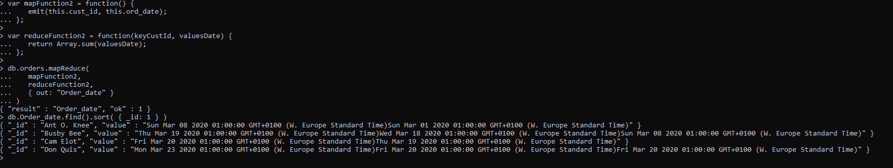

# DAT250: Software Technology Experiment Assignment 3
### Isabel Foster 

## Installation
I verified the installation as described by comparing the signature to the file


I continued with the installation without issues and further verified that the 
path variable was added correctly 


## Experiment 1 
I experienced no problems completing the different tutorials. 
Below follows screenshots form the different operations:

### Insert Documents


### Query Documents
I setup a database through mongoDB Compass called test, and created a collection inventory.
I then added the entries as described in the task. 


Then i attempted the different queries 


### Update Documents


### Delete Documents


### Bulk Write Operations
Result of bulk write operation: 


## Experiment 2 
For experiment 2 I followed the tutorial as described and additionally I made an operation to 
view the order dates for each customer. I think it's useful to be able to view order history and see
how frequent a customer places orders. 
In this case the map function shows only the dates the order was placed, additionally it could be interesting to see
which items were ordered. 
Below is the code and a screenshot of the result

```console
var mapFunction2 = function() {
   emit(this.cust_id, this.ord_date);
};


var reduceFunction2 = function(keyCustId, valuesDate) {
   return Array(valuesDate);
};


db.orders.mapReduce(
   mapFunction2,
   reduceFunction2,
   { out: "Order_date" }
)

db.Order_date.find().sort( { _id: 1 } )
```




## Final notes
No issues with installation or tutorials 

