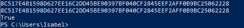
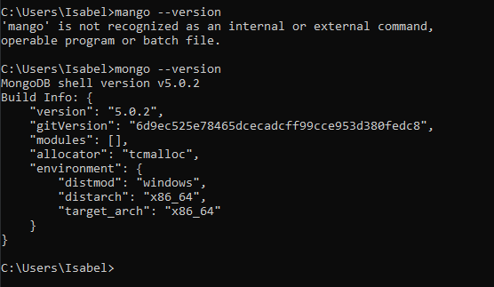
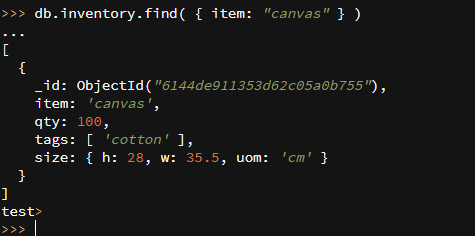
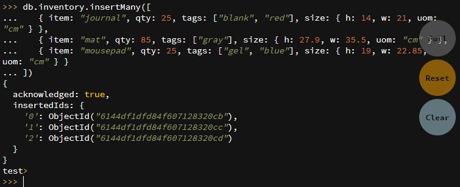
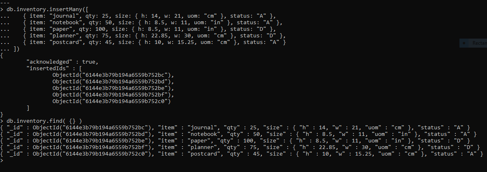
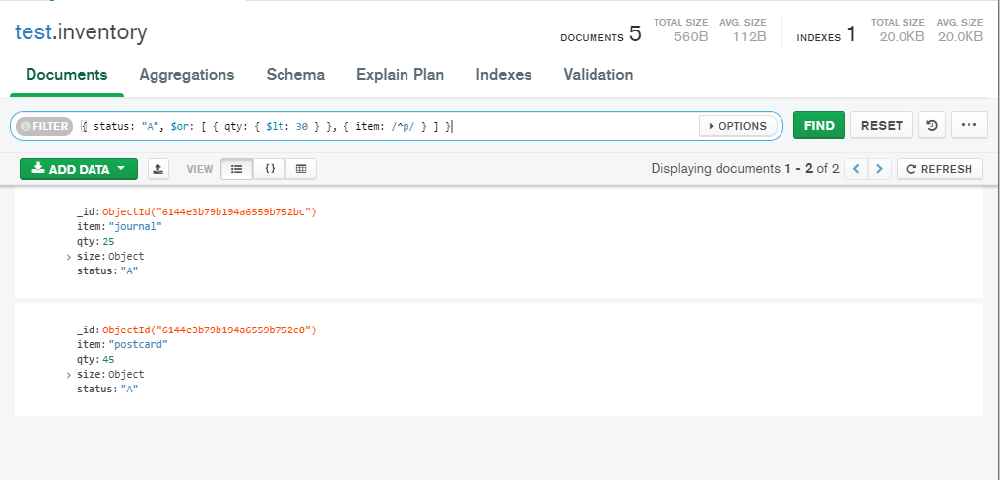
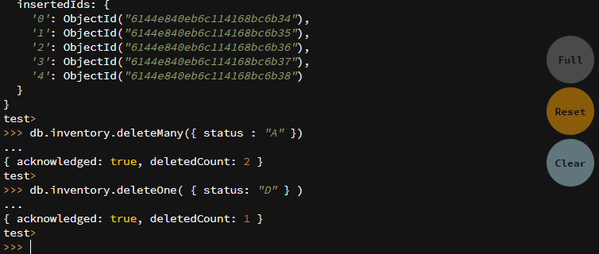
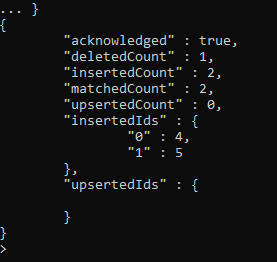

# DAT250: Software Technology Experiment Assignment 3
### Isabel Foster 

## Installation
I verified the installation as described by comparing the signature to the file

I continued with the installation without issues. 

It looks like the sims logo

Further verified that the path variable was added correctly 

## Experiment 1 
BLAAAAAAA

### Insert Documents

also

### Query Documents
BladilbaaaÏ setup a database through mongoDB Compass called test, and created a collection inventory.
I then added the entries as described in the task. 

Then i attempted the different queries 

### Update Documents

### Delete Documents
bladibla

### Bulk Write Operations
result of bulk write operation: 

## Experiment 2 
BLADIBLAAA

## Final notes

UGH

