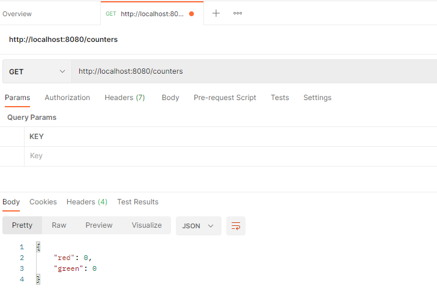
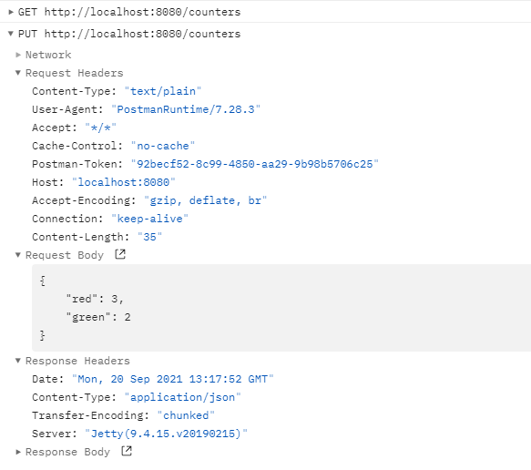
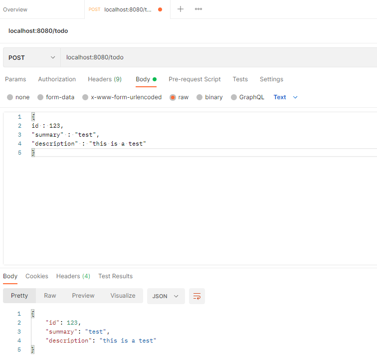
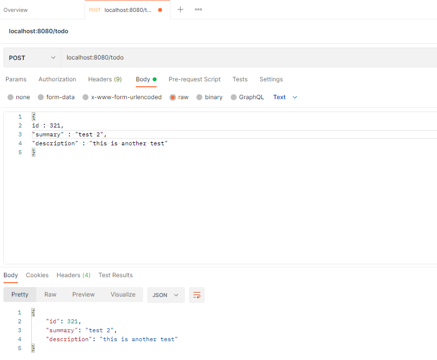
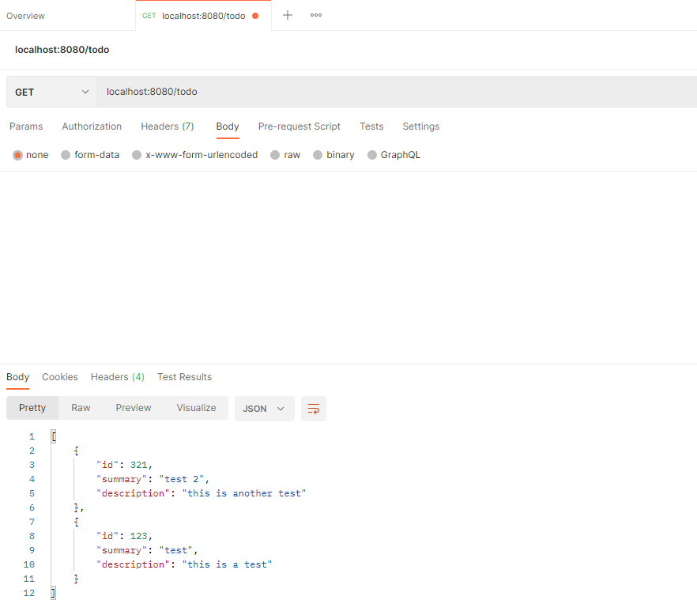
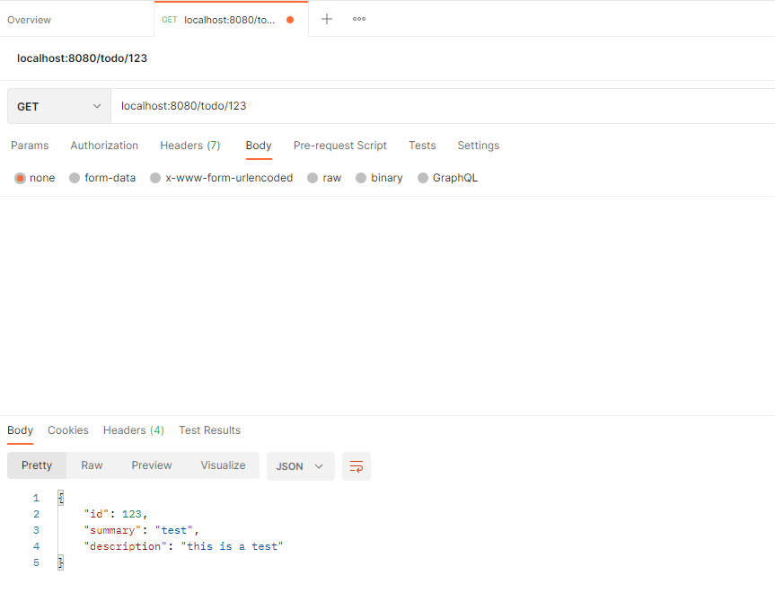
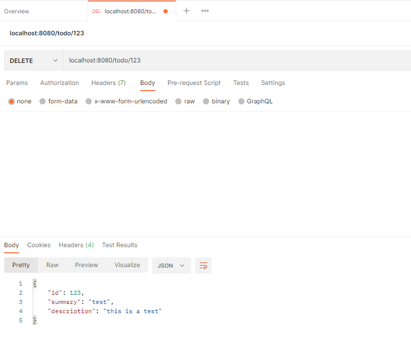
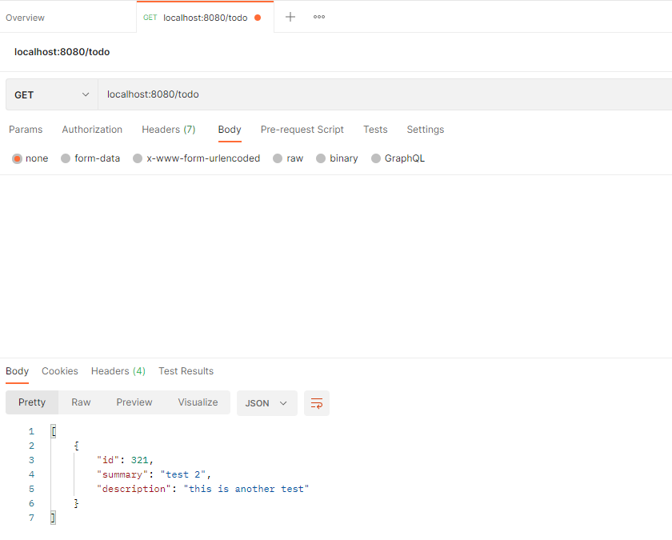

# DAT250: Software Technology Experiment Assignment 4
### Isabel Foster 

## Installation
Installed postman without issues. 

## Experiment 1
I ran App and verified that the process is deployed and functioning.

Used the get end put operations as described in the exercise without issues. 

## Experiment 2
Adding a test ot the database

And another 

Confirm that the tests were correctly added

Testing getting a specific entry

Testing delete

Verify it's gone

[Link to repository](https://github.com/IsaFoster/ex4)

## Final Notes
This took forever, so I was unable to attempt the optional experiments. 

