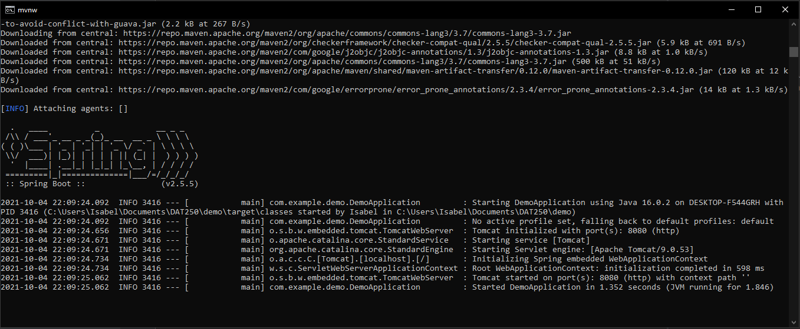
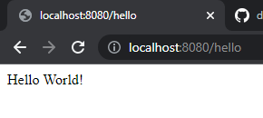
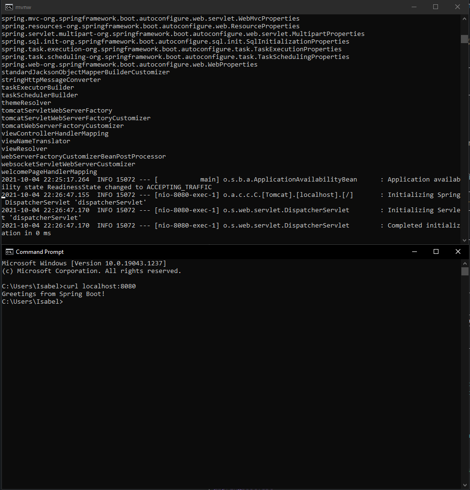
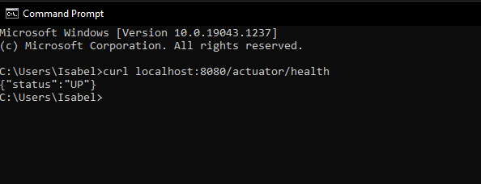
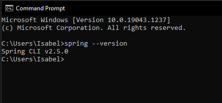
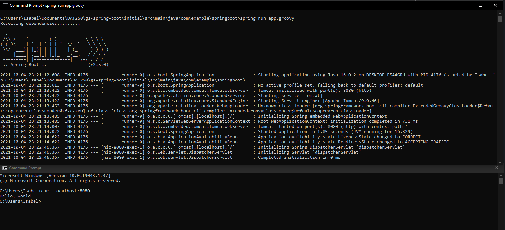
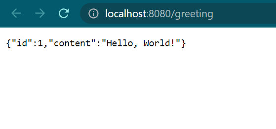
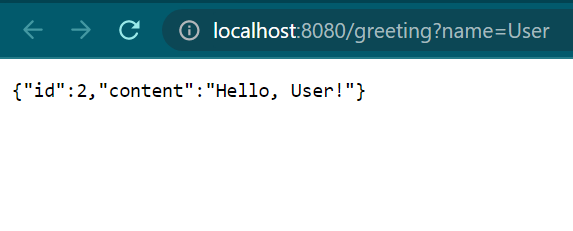
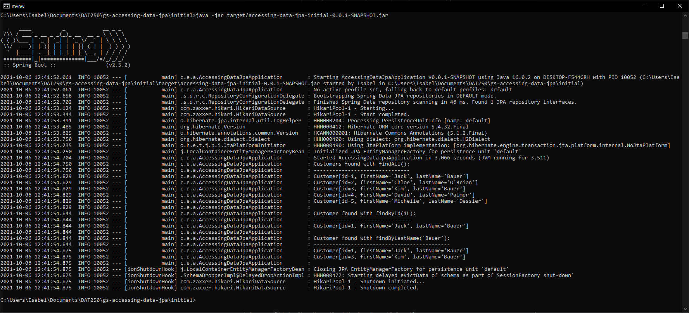

# DAT250: Software Technology Experiment Assignment 5
### Isabel Foster

## Experiment 1

Apparently my JAVA_HOME variable was not set up correctly, so my first attempt to build the project was
unsuccessful. Changing the path and restarting the application fixed the issue. 
It took a long time to download all the dependencies. 

This was the result. The code can be found in the folder "demo" in the repository referenced at the
end of the report. 

## Experiment 2

I cloned the repository and followed the tutorial as instructed. 
Once again a long download after running the spring-boot command.

I installed Spring Boot’s CLI and added to path

And created the .groovy in the springboot folder. Running it gave the following result:

The code can be found in the folder "initial" in the repository referenced at the
end of the report.

## Experiment 3

My file was named rest-service-initial-0.0.1-SNAPSHOT.jar, so after changing the command I
could run the .jar file and execute the code 

The code can be found in the folder "initial-ex3" in the repository referenced at the
end of the report.

## Experiment 4

Once again the jar file was named differently (I'm unsure why that is). 
Executing the .jar file gave the following:

## Final Notes

[Link to repository](https://github.com/IsaFoster/expass-5)
