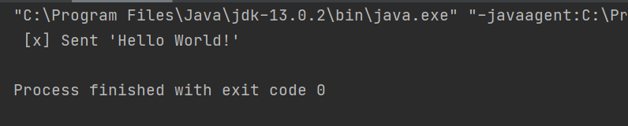
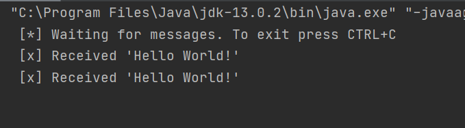
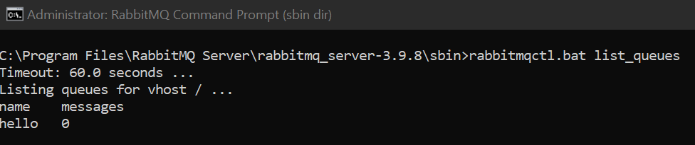
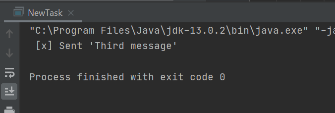
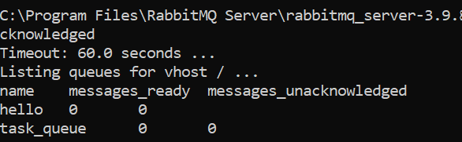
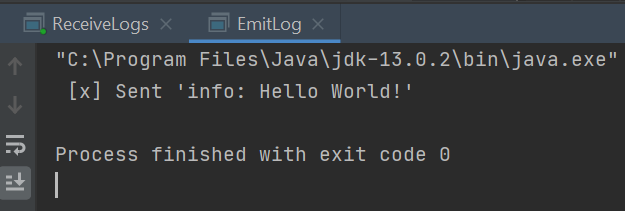
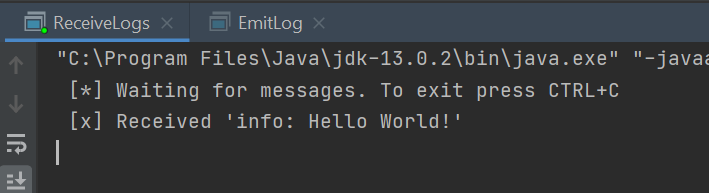
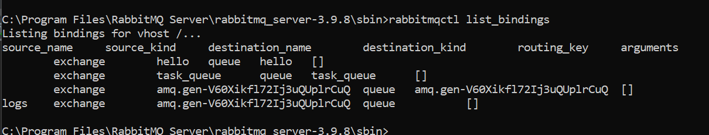

# DAT250: Software Technology Experiment Assignment 7
### Isabel Foster

## Experiment 1

No issues with installation

## Experiment 2

Had to add some additional dependencies to pom.xml, but otherwise no issues

Sendig message twice

Received both messages

Viewing the queue

## Experiment 3

Sending message

The queue again

## Experiment 4

Sending 

Receiving

Two queues

## Final Notes

No pending issues 

[Link to repository](https://github.com/IsaFoster/expass-7)
